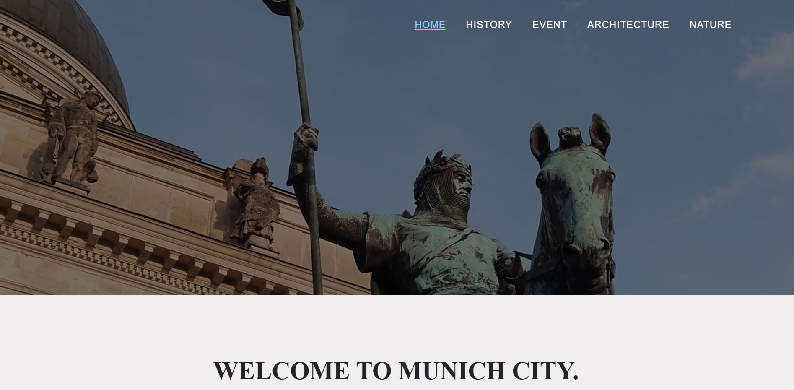
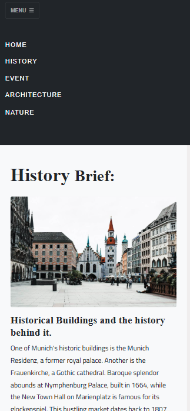

# 🍺 Munich Travel Guide: A Web & UX Case Study
### Responsive Ecosystem

**Live Platform Prototype:** [👉 Explore the Munich Guide](https://marquis09.github.io/narrative-website-marquis/)

An all-in-one, mobile-first digital guide designed to consolidate fragmented tourist information into a single, seamless, and frustration-free experience for international and local visitors traveling to the heart of Bavaria.

---

## 📱 Interface Architecture & Responsive Layout

### Responsive Ecosystem

*Engineered from the ground up for on-the-go travelers, featuring fluid Bootstrap layouts, rapid-access categories, and a clean, high-contrast visual hierarchy.*

---

## 📋 Project Breakdown
- **My Role:** UX Designer & Frontend Developer
- **Duration:** 6-Week Sprint
- **Tools Used:** Figma, VS Code, HTML5, CSS3, Bootstrap 5, JavaScript
- **Project Type:** Academic / Personal UX Research Case Study

---

## 🎯 1. The Challenge & User Pain Points
As a frequent traveler, I noticed that essential tourism resources for Munich were highly fragmented. Visitors were forced to constantly jump between multiple, non-mobile-friendly websites just to coordinate attractions, event timing, and traditional dining options. 

This **Information Fragmentation** meant tourists spent more time searching through unreliable interfaces than actually experiencing the city. 

### Success Metrics
*   **Usability:** Target a high System Usability Scale (SUS) score (greater than 70).
*   **Mobile Fidelity:** 100% responsive fluid grids designed explicitly for handheld, on-the-go viewing.
*   **Consolidation:** Unifying Attractions, Events, and Dining into a single interaction hub to eliminate external site-hopping.

---

## ⚙️ 2. The Design Process

### Discover & Define
I conducted a competitive analysis of legacy tourism platforms and surveyed past Munich visitors to extract major navigation friction points. This research directly informed the creation of our structured **Sitemap** and visual **Mood Board**.

### Low-Fidelity Wireframing
Prototypes were sketched out focusing strictly on mobile viewports first, testing user navigation paths to ensure that critical categories (like historical breweries or museums) could be reached in under three clicks.

---

## ✨ 3. Core Solutions & Key Features

*   **Centralized Information Hub:** Navigation is logically mapped around major user activities, allowing immediate, frictionless entry points to curated Bavarian spots.
*   **Mobile-First Responsiveness:** By leveraging a Bootstrap 5 grid foundation, all text scaling, image properties, and navigation components stack seamlessly across smartphone and tablet screens.
*   **Interactive Target Vectors:** Implemented basic search structures and strategic framework mappings to easily allow future localization updates.

---

## 🚀 4. Retrospective & Future Pipeline

> 💡 **Key Learning:** Prototyping early with authentic media assets and real location text exposed structural spacing issues that generic dummy text (*Lorem Ipsum*) would have hidden, leading to a much cleaner production phase.

### Next Evolution Steps
1.  **Real-Time API Integration:** Hooking up live event feeds to display real-time local happenings and festivals dynamically.
2.  **Multilingual Engines:** Implementing language localization strings to make the guide accessible to a wider international visitor base.
3.  **Map Layer Integration:** Injecting the Google Maps API to offer real-time, proximity-based route planning.
